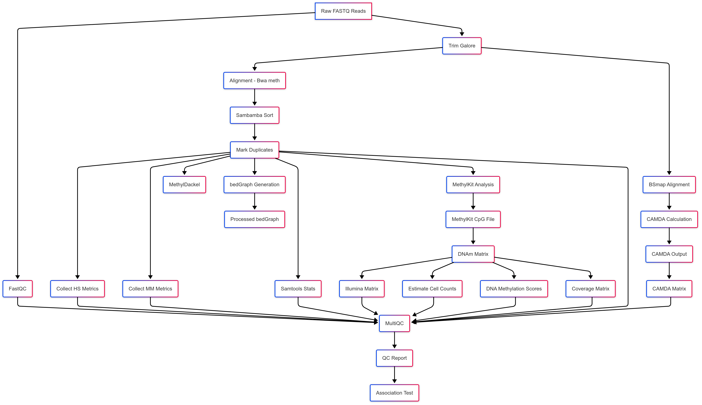

# Methylhead · Panel‑WGBS Analysis Pipeline

**Methylhead** is a modular **Nextflow** workflow that turns raw targeted‑bisulfite FASTQ files into QC‑checked methylation matrices, cell‑composition estimates and model‑based risk scores—ready for statistics or reporting.

---
## 🌟 Why Methylhead? — Feature highlights

* **End‑to‑end panel‑WGBS**     ▶︎  From raw FASTQ to sample‑level risk scores with a single command.
* **Cell‑composition inference**▶︎ Blood‑cell deconvolution using bundled reference libraries.
* **Model‑based predictions**   ▶︎ Runs arbitrary EWAS/age/risk models defined in a CSV.
* **Reproducible & portable**   ▶︎ Fully containerised (Apptainer); no system installs beyond Java 11.
* **Modular Nextflow core**     ▶︎ Parallel execution, --resume, profile support.
* **Rich QC out‑of‑the‑box**    ▶︎ Per‑sample & per‑locus thresholds, MultiQC and Quarto HTML/PDF reports.
---

## 1 · Clone the repository

```bash
# Pick any folder you like
git clone https://github.com/onuroztornaci/methylhead.git
cd methylhead
```

---

## 2 · Quick start (≈ 5 min)

```bash
# Install & activate Nextflow if you haven’t yet
conda create -y -n methylhead nextflow -c bioconda
conda activate methylhead

# Run the built‑in demo (downloads containers on first run)
nextflow run main.nf -C nextflow-test.config --resume
```
* -C <file> tells Nextflow to **merge** the specified config file with the default nextflow.config.
* Full options: [Nextflow docs › configuration](https://www.nextflow.io/docs/latest/config.html)
* The demo dataset is documented inside the test/ folder—see [test/README.md](test/README.md) for details.
* Leave out -N if you do **not** want an email summary.
* --resume lets Nextflow **pick up from where a previous run left off**—it will skip any steps that already finished successfully. More: [Nextflow docs › resume](https://nextflow.io/docs/latest/cache-and-resume.html)

---

## 3 · Prerequisites

| Requirement   | Tested version | Check with            |
| ------------- | -------------- | --------------------- |
| **Apptainer** |  ≥ 1.1.0       | `apptainer --version` |
| **Conda**     |  ≥ 23.x        | `conda -V`            |
| Internet      | outbound HTTPS | —                     |

* **Apptainer ≥ 1.1** ([install guide](https://apptainer.org/docs/))
* **Conda ≥ 23.x** ([install guide](https://docs.conda.io/en/latest/miniconda.html))

---

## 4 · (One‑off) Build the reference genome (≈ 2 h)

```bash
bash scripts/prepare-reference-genome.sh -N you@example.com
```

*Creates `reference/hg19/` with all **bwameth** indices.*
Skip this step if you already have an indexed hg19 reference.

---

## 5 · Run on your own samples

```bash
nextflow run main.nf \
  --data            path/to/fastqs/*.fastq.gz \
  --genome_folder   path/to/hg19.fa \
  --panel           path/to/panel.bed \
  --panel_qc        path/to/panel_qc.csv \
  --phenotype       path/to/phenotype.csv \
  --models          path/to/models.csv \
  --outdir          results/ \
  -N you@example.com \
  --resume
```

### Mandatory parameters

| Flag              | Description                                    | Example             |
| ----------------- | ---------------------------------------------- | ------------------- |
| `--data`          | Glob of **gz‑compressed FASTQ** files          | `mydata/*.fastq.gz` |
| `--genome_folder` | *Indexed* hg19 FASTA (`.fa` + `.bwt/.amb/...`) | `reference/hg19.fa` |
| `--panel`         | BED with CpG loci in your capture panel        | `data/panel.bed`    |
| `--panel_qc`      | CSV with per‑locus QC thresholds               | `data/panel_qc.csv` |
| `--phenotype`     | Sample‑level metadata                          | `pheno.csv`         |
| `--models`        | EWAS / risk‑prediction model definitions       | `models.csv`        |

> **See [`input/README.md`](input/README.md) for file formats & examples.**

Optional flags:

| Flag                | Purpose                 | Default    |
| ------------------- | ----------------------- | ---------- |
| `--outdir`          | Where results go        | `results/` |
| `-N`                | Email run summary       | off        |
| `--wgbs_image` etc. | Override container URIs | built‑ins  |

---

## 6 · Outputs at a glance

```
results/
├── alignments/          # deduplicated BAM + stats
├── methylation_calls/   # BedGraphs per sample
├── matrices/            # CpG, coverage & 450k matrices
├── qc/                  # MultiQC + HTML/PDF report
└── predictions/         # Risk scores & association tests
```

---

## 7 · Workflow overview

[`flowchart/`](flowchart/) contains both an auto‑generated Nextflow DAG and a hand‑annotated flowchart.

| File                       | Description                     |
| -------------------------- | ------------------------------- |
| `methylhead_dag.png`       | Task‑level DAG (`nextflow dag`) |
| `methylhead_flowchart.svg` | High‑level overview             |

Embed the DAG in slides:

```markdown

```

---

## 8 · Containers in use

| Flag           | Default URI                                                        | Includes                        |
| -------------- | ------------------------------------------------------------------ | ------------------------------- |
| `--wgbs_image` | `oras://docker.io/onuroztornaci/methylhead-pipeline:wgbs_analysis` | WGBS aligners & QC              |
| `--meth_image` | `oras://docker.io/onuroztornaci/methylhead-pipeline:meth_analysis` | R 4.4.3, Python 3, Bioconductor |
| `--qc_image`   | `oras://docker.io/onuroztornaci/methylhead-pipeline:qc_container`  | R 4.4.1, Quarto                 |

Build your own images → see `container-def-files/`.

---

## 9 · Bundled panel files

* `data/blood_cell_types_extended.bed` — CpG coordinates
* `input/panel.csv` — per‑locus metadata & QC

Override with `--panel` and `--panel_qc` if you have a different panel.

---

## 10 · Troubleshooting cheatsheet

| Symptom                       | Likely cause & fix                                                        |
| ----------------------------- | ------------------------------------------------------------------------- |
| `ERROR: Apptainer not found`  | Install Apptainer ≥ 1.1 and add it to `$PATH`.                            |
| Java `<11` warning            | Forgot to `conda activate methylhead`.                                    |
| `No FASTQ files`              | Check your `--data` glob – must end in `.fastq.gz`.                       |
| `Index not found for hg19.fa` | Run **4 · reference build** or point `--genome_folder` to an indexed ref. |

---

Happy methylating 🧬🚀
